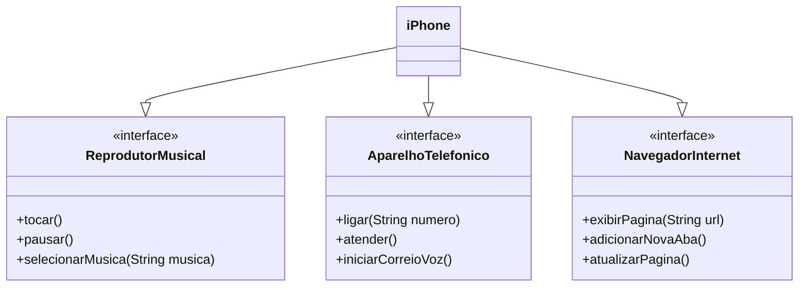

```mermaid
classDiagram
    iPhone --|> ReprodutorMusical
    iPhone --|> AparelhoTelefonico
    iPhone --|> NavegadorInternet
    class ReprodutorMusical{
      +tocar()
      +pausar()
      +selecionarMusica(String musica)
    }
    <<interface>> ReprodutorMusical
    class AparelhoTelefonico{
      +ligar(String numero)
      +atender()
      +iniciarCorreioVoz()
    }
    <<interface>> AparelhoTelefonico
    class NavegadorInternet{
      +exibirPagina(String url)
      +adicionarNovaAba()
      +atualizarPagina()
    }
    <<interface>> NavegadorInternet
```